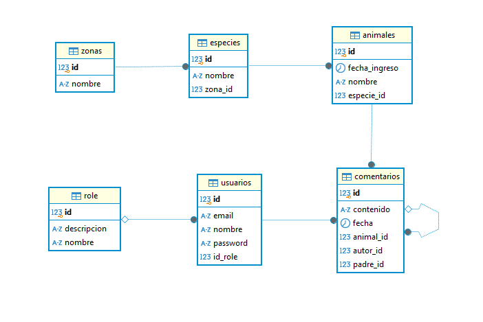

# Gestión Zoológico
Aplicación backend para la gestión integral de un zoológico, que permite administrar zonas, especies, animales y usuarios. Incluye un sistema de comentarios anidados para cada animal, facilitando la comunicación y seguimiento de observaciones por parte de empleados.

# Estructura del código

- `advice`: manejo centralizado de errores.
- `configuration`: configuracion de OpenApi, Bean, carpeta security y initialization.
- `constans`: contiene todas las constants que hay en el proyecto.
- `controller`: endpoints de la API.
- `dto`: objetos de transferencia de datos.
- `entity`: entidades JPA.
- `exception`: todas las excepciones que se usan.
- `repository`: acceso a datos.
- `service`: lógica de negocio.

# Instalación y configuración

Antes de empezar, asegúrate de tener instalados y configurados los siguientes elementos:

- Java 17
- Gradle 8.5
- Base de datos PostgreSQL (con las variables de entorno `USER` y `PASSWORD` ya configuradas).

## 🛠️ Pasos para configurar el entorno local

1. Clona este repositorio en tu máquina local.
2. Importa el proyecto en tu IDE favorito.
3. Instala las dependencias del proyecto usando Gradle.
4. Crea las bases de datos PostgreSQL necesaria (`gestion-zoologico`).
5. Configura las variables de entorno necesarias para la base de datos.

### 🔧 Configuración de variables de entorno para PostgreSQL

En tu IDE (ej. IntelliJ IDEA):

1. Dirígete a `Run/Debug Configurations`.
2. Selecciona la configuración del microservicio actual (por ejemplo, `gestion-zoologico`).
3. En la sección **Environment Variables**, agrega las siguientes:

| Variable | Descripción |
|----------|-------------|
| `USER`   | Usuario de tu base de datos PostgreSQL. *(Lo puedes encontrar en PgAdmin en `PostgreSQL -> Properties -> Connection -> Username`)* |
| `PASSWORD` | Contraseña de tu base de datos PostgreSQL. |

---

### 🔐 Configuración de variables JWT

En la misma sección de **Environment Variables**, añade también:

| Variable           | Descripción                                                                                                                                               |
|--------------------|-----------------------------------------------------------------------------------------------------------------------------------------------------------|
| `KEYSECRET_SECURITY`| Clave secreta para firmar y validar los JWT. Usa una cadena segura aleatoria. Puedes generar una con el comando `openssl rand -base64 64` desde Git Bash. |
| `EXPIRE_MS_SECURITY`| Tiempo de expiración del token en milisegundos (poner, `86400000` que equivale a 1 día).                                                                  |

#### 💡 Ejemplo de valores:
```env
KEYSECRET_SECURITY=FcdKmEV6u/EzvXzFEDg4xsR/zivknMrKR9GoluF3fFG8Zi9Ybw37TEVwToaVIhBjm3vaiE0L+RD+hyPwid9BcA==
EXPIRE_MS_SECURITY=86400000
```

## 📚 Documentación de la API

- **Gestión-Zoológico**: [http://localhost:8091/swagger-ui/index.html#/](http://localhost:8091/swagger-ui/index.html#/)

---

## 🧩 Modelo Entidad-Relación

Puedes encontrar el modelo entidad-relación (MER) de la base de datos en la carpeta [`/docs`](./docs/modelo-er.png):



## 📝 Licencia

Este proyecto está licenciado bajo la **Apache License**. Consulta el archivo [`LICENSE`](./LICENSE) para más información.

---

## 💬 Comentarios

Si tienes algún comentario sobre el repositorio, por favor házmelo saber para poder mejorar 🙂

📫 **Cómo contactarme**: heinnervega20@gmail.com


