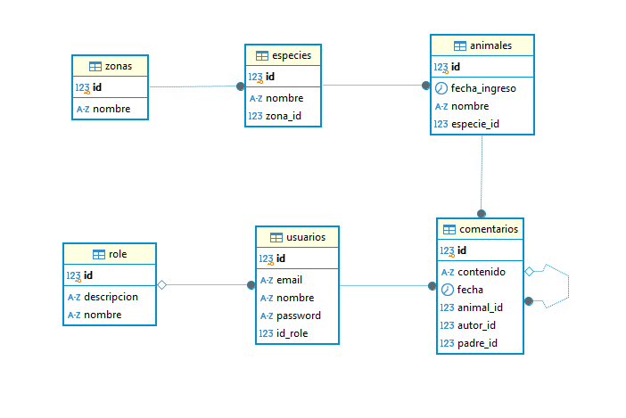

# Gestión Zoológico
Aplicación backend para la gestión integral de un zoológico, que permite administrar zonas, especies, animales y usuarios. Incluye un sistema de comentarios anidados para cada animal, facilitando la comunicación y seguimiento de observaciones por parte de empleados.

El sistema está compuesto por dos microservicios independientes:

- **zoologico-service**: núcleo del negocio — expone la API REST, gestiona la base de datos PostgreSQL y coordina el envío de notificaciones.
- **messaging-service**: servicio de mensajería — escucha colas SQS, genera archivos Excel/PDF y los almacena en S3, enviando notificaciones por correo.

# Estructura del código

## zoologico-service

- `advice`: manejo centralizado de errores.
- `client`: cliente Feign para la comunicación con `messaging-service`.
- `configuration`: configuracion de OpenApi, Bean, carpeta security y initialization.
- `constants`: contiene todas las constants que hay en el proyecto.
- `controller`: endpoints de la API.
- `dto`: objetos de transferencia de datos.
- `entity`: entidades JPA.
- `exception`: todas las excepciones que se usan.
- `repository`: acceso a datos.
- `service`: lógica de negocio.

## messaging-service

- `configuration`: configuración de AWS (SQS, S3), correo y seguridad JWT.
- `controller`: endpoint para envío manual de notificaciones.
- `dto`: objetos de transferencia de datos.
- `exception`: excepciones del servicio de mensajería.
- `repository`: acceso a MongoDB.
- `service`: lógica de procesamiento de mensajes SQS y envío de correos.

# Instalación y configuración

Antes de empezar, asegúrate de tener instalados y configurados los siguientes elementos:

- Java 17
- Gradle 8.5
- Base de datos PostgreSQL (con las variables de entorno `DB_URL`, `USER` y `PASSWORD` ya configuradas).
- Base de datos MongoDB (con la variable de entorno `MONGODB_URI` ya configurada).
- Cuenta AWS con acceso a **SQS** y **S3** (variables `AWS_REGION`, `AWS_ACCESS_KEY`, `AWS_SECRET_KEY`).

## 🛠️ Pasos para configurar el entorno local

1. Clona este repositorio en tu máquina local.
2. Importa el proyecto en tu IDE favorito.
3. Instala las dependencias del proyecto usando Gradle.
4. Crea la base de datos PostgreSQL necesaria (`gestion-zoologico`).
5. Asegúrate de tener MongoDB corriendo y accesible.
6. Configura las variables de entorno necesarias para cada servicio.

### 🔧 Variables de entorno — zoologico-service

En tu IDE (ej. IntelliJ IDEA):

1. Dirígete a `Run/Debug Configurations`.
2. Selecciona la configuración del microservicio `zoologico-service`.
3. En la sección **Environment Variables**, agrega las siguientes:

**Base de datos PostgreSQL**

| Variable   | Descripción |
|------------|-------------|
| `DB_URL`   | URL de conexión JDBC. Por defecto: `jdbc:postgresql://localhost:5432/gestion-zoologico` |
| `USER`     | Usuario de PostgreSQL. *(PgAdmin → PostgreSQL → Properties → Connection → Username)* |
| `PASSWORD` | Contraseña de PostgreSQL. |

**JWT**

| Variable              | Descripción |
|-----------------------|-------------|
| `KEYSECRET_SECURITY`  | Clave secreta para firmar y validar los JWT. Genera una con `openssl rand -base64 64` desde Git Bash. |
| `EXPIRE_MS_SECURITY`  | Tiempo de expiración del token en milisegundos. Usar `86400000` (1 día). |

**AWS**

| Variable         | Descripción |
|------------------|-------------|
| `AWS_REGION`     | Región de AWS donde están los recursos. Ej: `us-east-1`. |
| `AWS_ACCESS_KEY` | Access Key ID de tu usuario IAM. |
| `AWS_SECRET_KEY` | Secret Access Key de tu usuario IAM. |

**Schedulers (cron)**

| Variable     | Descripción |
|--------------|-------------|
| `EXCEL_CRON` | Expresión cron para el job que procesa Excel. Ej: `0 0 * * * *`. |
| `PDF_CRON`   | Expresión cron para el job que procesa PDF. Ej: `0 0 * * * *`. |

#### 💡 Ejemplo de valores JWT:
```env
KEYSECRET_SECURITY=FcdKmEV6u/EzvXzFEDg4xsR/zivknMrKR9GoluF3fFG8Zi9Ybw37TEVwToaVIhBjm3vaiE0L+RD+hyPwid9BcA==
EXPIRE_MS_SECURITY=86400000
```

---

### 🔧 Variables de entorno — messaging-service

En la configuración de `messaging-service`, agrega:

**MongoDB**

| Variable      | Descripción |
|---------------|-------------|
| `MONGODB_URI` | URI de conexión a MongoDB. Ej: `mongodb://localhost:27017/messaging`. |

**JWT (compartida con zoologico-service)**

| Variable             | Descripción |
|----------------------|-------------|
| `KEYSECRET_SECURITY` | La misma clave secreta JWT configurada en `zoologico-service`. |

**AWS SQS**

| Variable          | Descripción |
|-------------------|-------------|
| `EXCEL_QUEUE_URL` | URL de la cola SQS principal para procesamiento de Excel. |
| `EXCEL_DLQ_URL`   | URL de la Dead Letter Queue de Excel. |
| `PDF_QUEUE_URL`   | URL de la cola SQS principal para procesamiento de PDF. |
| `PDF_DLQ_URL`     | URL de la Dead Letter Queue de PDF. |

**AWS S3**

| Variable        | Descripción |
|-----------------|-------------|
| `S3_BUCKET_NAME`| Nombre del bucket S3 donde se almacenan los archivos generados. |

---

## 📚 Documentación de la API

- **zoologico-service**: [http://localhost:8091/swagger-ui/index.html#/](http://localhost:8091/swagger-ui/index.html#/)
- **messaging-service**: [http://localhost:8092/swagger-ui/index.html#/](http://localhost:8092/swagger-ui/index.html#/)

---

## 🧩 Modelo Entidad-Relación

Puedes encontrar el modelo entidad-relación (MER) de la base de datos en la carpeta [`/docs`](./docs/modelo-er.png):




# ✔️ Cobertura de Tests

Se desarrollaron **tests unitarios** enfocados en la capa de servicios (`service`), la cual contiene la lógica principal del negocio.

- 📈 **Cobertura alcanzada**: **92%** (`266/287` líneas cubiertas).
- 🧪 Se utilizaron librerías como `JUnit 5` y `Mockito` para facilitar las pruebas y la simulación de dependencias.
- 🔍 Las pruebas abarcan flujos de negocio como:
    - Registro y autenticación de usuarios.
    - Gestión de zonas, especies y animales.
    - Comentarios anidados.
    - Lógica de búsqueda avanzada por criterios.

## 📝 Licencia

Este proyecto está licenciado bajo la **Apache License**. Consulta el archivo [`LICENSE`](./LICENSE) para más información.

---

## 💬 Comentarios

Si tienes algún comentario sobre el repositorio, por favor házmelo saber para poder mejorar 🙂

📫 **Cómo contactarme**: heinnervega20@gmail.com
